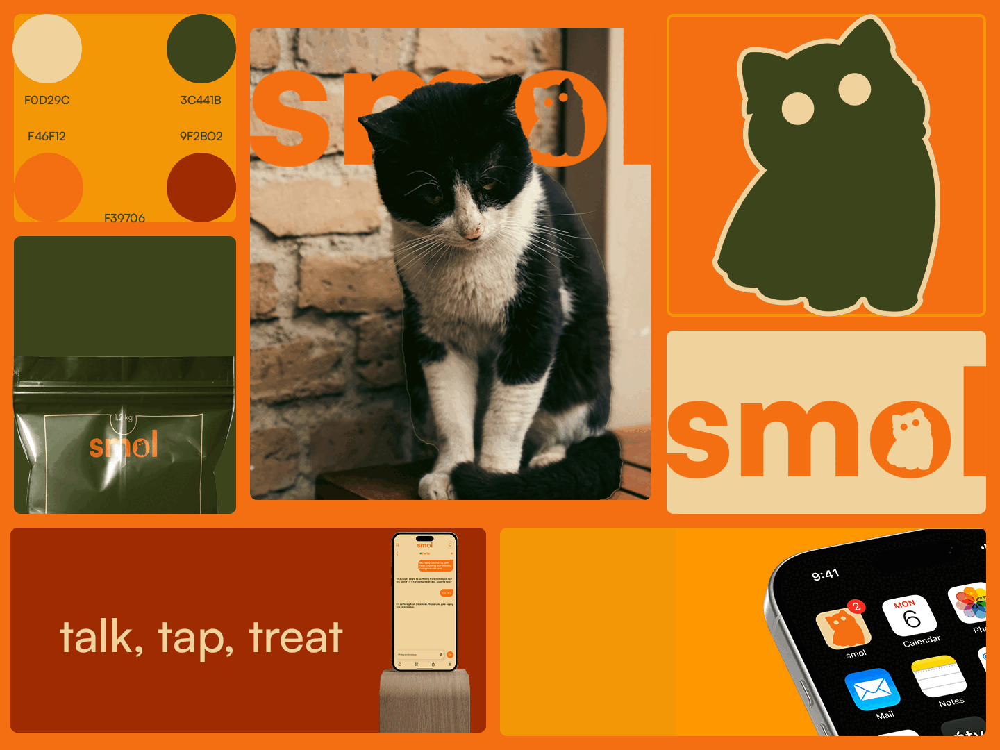
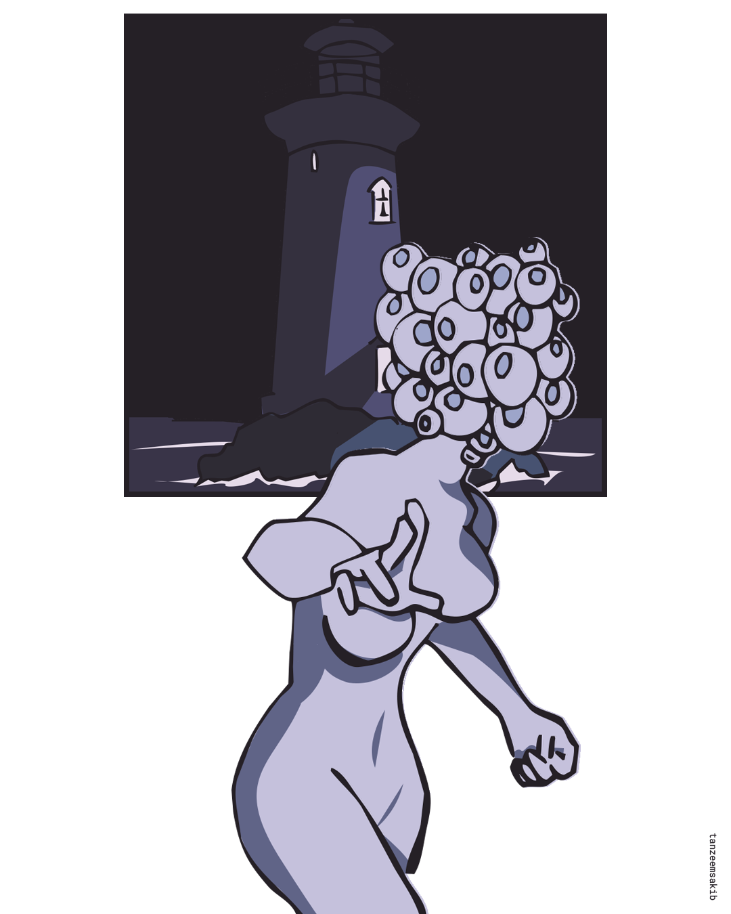

**Indie Game Developer and Visual Artist**

I am Tanzeem Ahmed, a senior at University of Dhaka, with a major in Applied
Mathematics and currently based in Dhaka, Bangladesh. My interests lie in machine
learning and data analysis. I am also involved in digital art and game development for
projects-competitions, and professional commissions.

## smol – Well-being FMCG Brand Design

Created for a business case competition, _smol_ is a locally produced and procured pet food brand centered on well-being and sustainability. With clearly advertised nutrient values and eco-friendly packaging, the brand is designed to appeal to health-conscious, eco-aware pet owners. The visual identity reflects a wholesome and approachable tone, aligned with the brand’s values.

<a href="https://www.behance.net/tanzeemsakib" style="color: black; text-decoration: underline;">See more&gt;&gt;</a>

## Illustration | Personal Work

A surreal composition inspired by manga panel layouts and Lovecraftian horror, this piece combines clean contour lines with a limited range of desaturated blues, lending a cold, distant tone to evoke a sense of deep-sea dread and quiet madness—hinting at themes of obsession, fear, and cosmic awareness.

<a href="https://www.behance.net/tanzeemsakib" style="color: black; text-decoration: underline;">See more&gt;&gt;</a>
